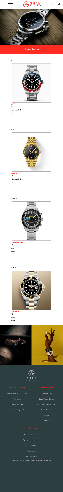
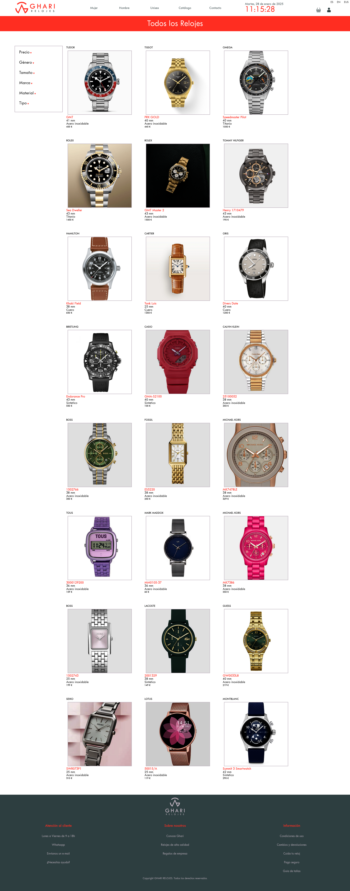
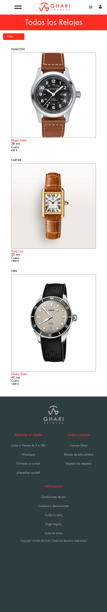
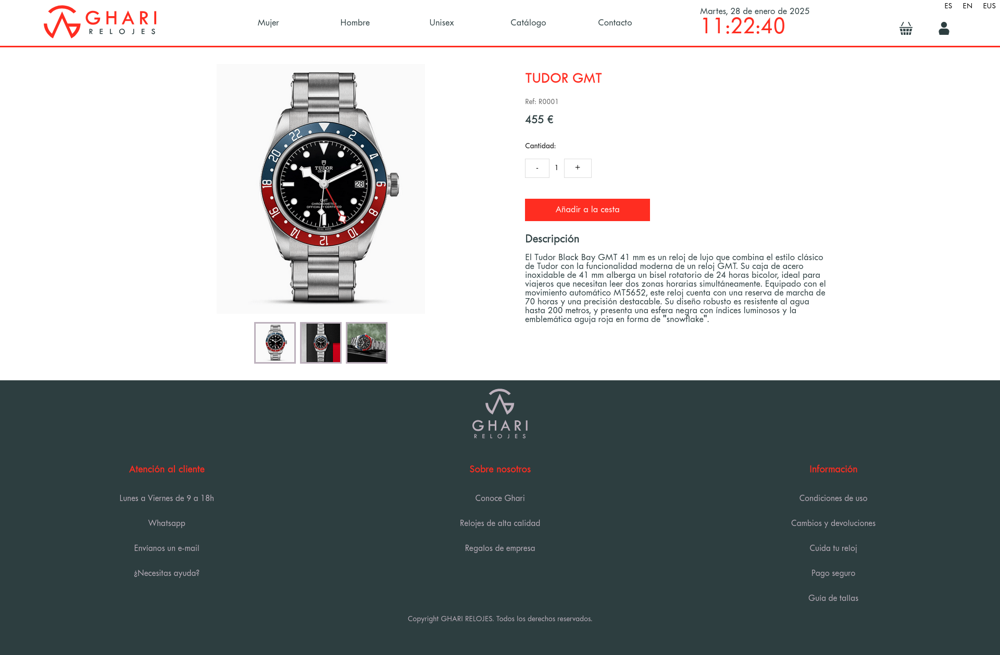
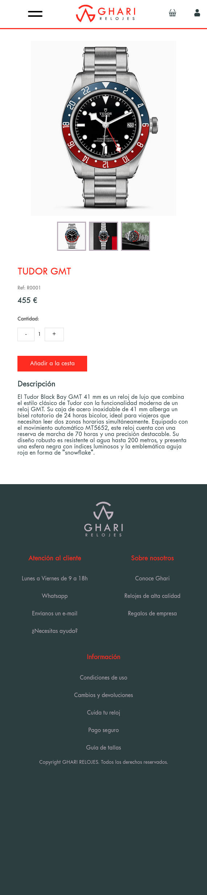
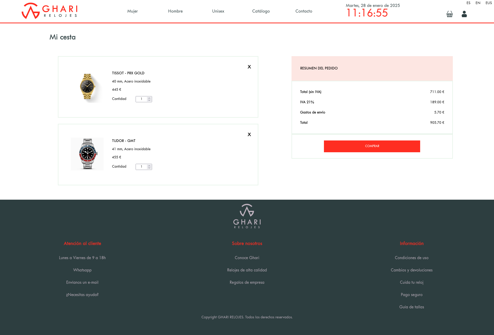
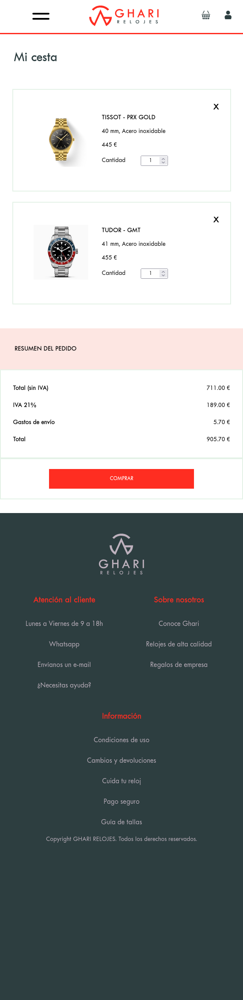
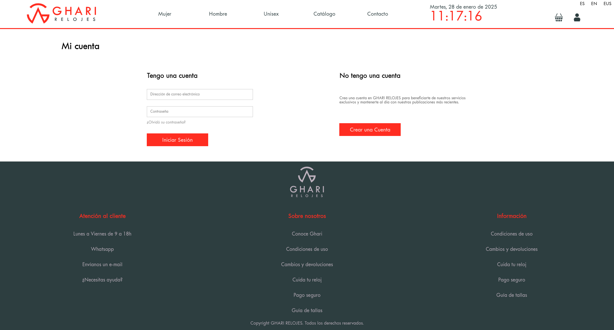
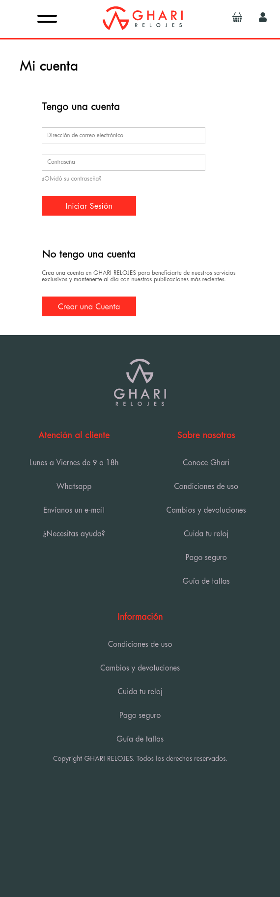

# Proyecto Tienda Online - GHARI RELOJES  

  
  

## Descripción del Proyecto  
**GHARI RELOJES** es una tienda online desarrollada como parte de un proyecto de clase. Este sitio simula una tienda funcional con un diseño moderno, funcionalidades interactivas y una experiencia de usuario optimizada.  

El proyecto se creó utilizando **HTML**, **CSS** y **JavaScript**, con características dinámicas que lo hacen atractivo y funcional.  

---

## Características Principales  

### 🌐 Multilenguaje  
- Disponible en **tres idiomas**: español, inglés y euskera.  
- Cambio dinámico del contenido al seleccionar un idioma.  

### 📄 Uso de Archivos JSON  
- Los datos de los productos se cargan directamente desde archivos JSON.  
- Facilita la actualización y mantenimiento del catálogo de productos.  

### ⚡ Interactividad con JavaScript  
- **Pop-Up:** Muestra un mensaje de confirmación cuando se añade un producto al carrito.  
- **Fecha y Hora Dinámicas:** Se actualizan en tiempo real en la interfaz.  
- **Eventos Dinámicos:** Gestión de botones, idioma y elementos interactivos en toda la página.  

### 🛒 Gestión del Carrito con LocalStorage  
- **Persistencia de Datos:** Los productos añadidos al carrito se almacenan en el `localStorage`, garantizando que permanezcan incluso después de recargar la página.  
- **Integración del Carrito y Checkout:** Los datos almacenados se utilizan para mostrar los productos en las páginas de carrito y checkout.  

### 📱 Responsive Design  
- La tienda se adapta perfectamente a cualquier dispositivo: ordenadores, tablets y móviles.  
- Implementación de **CSS Grid** y **Flexbox** para un diseño fluido y adaptable.  

---

## Funcionalidades Clave  

1. **Carga Dinámica de Productos:**  
   Los productos disponibles se cargan desde un archivo JSON mediante la API `fetch`, lo que permite una actualización sencilla del catálogo.  

2. **Selección de Idioma:**  
   - El usuario puede cambiar entre español, inglés y euskera.  
   - Los textos se actualizan automáticamente en toda la página gracias a un sistema dinámico basado en objetos.  

3. **Gestión del Carrito:**  
   - **Añadir al Carrito:** Los productos seleccionados se almacenan en el `localStorage`.  
   - **Pop-Up:** Aparece un mensaje de confirmación al añadir un producto.  
   - **Página de Carrito:** Recupera y muestra los datos del carrito almacenados en el `localStorage`.  
   - **Checkout:** Integra los datos para simular el proceso de compra.  

4. **Actualización de Fecha y Hora:**  
   - Implementada con JavaScript para mantener la información actualizada en tiempo real.  

5. **Interactividad y Experiencia de Usuario:**  
   - Botones y enlaces dinámicos.  
   - Efectos visuales y mensajes interactivos que mejoran la experiencia.  

---

## Capturas de Pantalla  

### Index 

  
    

### Catálogo 

  
   

### Página de producto 

  
   

### Página del Carrito  

  
   

 

### Página de usuario

  
   

 

---

## Tecnologías Utilizadas  

- **HTML:** Para la estructura de la página.  
- **CSS:** Para el diseño y la responsividad.  
- **JavaScript:**  
  - Manejo de datos dinámicos.  
  - Interacción con el `localStorage`.  
  - Cambios de idioma.  
  - Implementación de pop-ups y elementos interactivos.  

## :sparkles:Equipo:
Azalfa: https://github.com/zille5
 
Allan: https://github.com/Allan941709
 
Aleeza: https://github.com/Aleeza951
 
Nerea: https://github.com/nereasaga ---> Scrum Master
 
Moisés: https://github.com/moisescolman ---> Product Owner

